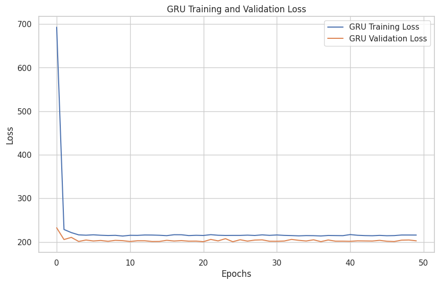

# 🛍️ Consumer Behavior Prediction and Personalization in Retail


**MA981 Dissertation — University of Essex** 🎓
*School of Mathematics, Statistics and Actuarial Science*
*December 2024*

---

## 👋 What This Project Is About

Retail businesses collect a lot of customer data but most of them don't really know what to do with it. They send the same email to everyone, stock products based on gut feeling, and only find out about fraud after the damage is done. 📉

I wanted to see if machine learning could actually fix that — not in theory, but with real data. So I took a dataset of 3,900 retail customers and built a pipeline that answers three questions:

* **Who are my customers and how do I group them?** 👥
* **Is anything suspicious happening in my transactions?** 🚨
* **What will my customers buy next?** 🔮

---

## 💼 The Business Problem

Imagine you run an online clothing store. You've got thousands of customers but you're treating them all the same — same promotions, same emails, same everything. Some of them haven't bought anything in months. Some of them spend hundreds every week. You're wasting money on people who don't care and not rewarding the ones who do. 💸

On top of that, you have no idea if some of those transactions are fraudulent until it's too late. This project tackles all of that. 🛠️

---

## 🏗️ What I Did

I didn't just train one model and call it done. I built three separate systems that work together:

* **Customer Segmentation** 👥: Used **DBSCAN** to group customers by how often they buy and how much they spend. Ended up with 113 clusters and flagged 1,344 outliers that needed a closer look.
* **Anomaly Detection** ⚠️: Trained an **Autoencoder** (neural network) to learn what "normal" purchasing looks like, then flagged anything that didn't fit. About 5% of the data came back as anomalous.
* **Purchase Forecasting** 📈: Compared six different models — **TCN, GRU, LSTM, XGBoost, Attention, and a Hybrid GRU-Attention model** — to see which one predicted future purchases most accurately.

---

## 📊 Exploratory Data Analysis

Before building anything, I spent time just understanding the data. 🔍

**What categories do people buy?** 👗

*Clothing dominates the market, followed by Accessories. Footwear and Outerwear represent niche segments.*

**Does gender affect what people buy?** 👫

*Males significantly outpurchase females in this dataset, particularly in Clothing and Accessories—a key signal for targeted ad spend.*

---

## 🔵 Clustering Results


The t-SNE plot shows the customer clusters. Most customers sit in that dense purple mass in the middle — your typical average shoppers. The scattered coloured dots are the interesting ones — niche segments that behave differently and probably need a different approach. 📍

| What We Found | Number |
|---|---|
| **Clusters Identified** | 113 |
| **Outliers Flagged** | 1,344 |
| **Silhouette Score** | -0.372 |
| **Davies-Bouldin Index** | 1.634 |

> **Honest note:** The Silhouette Score being negative tells you the clusters overlap quite a bit. That's partly a limitation of the dataset and something I'd love to tune further with more time. 🧪

---

## 🔴 Anomaly Detection


The dashed line is the 95th percentile threshold. Anything to the right of that got flagged. Most transactions are normal and sit in that bell curve. The ones that fall way outside it are worth a second look — could be fraud, could be a bulk buyer, or a "whale" customer. 🐋

| What We Found | Number |
|---|---|
| **Anomalies Detected** | 195 |
| **Percentage of Data** | ~5% |

---

## 🥇 Model Performance

I trained and compared six models. Here's the leaderboard: 🏆

| Model | MAE | RMSE |
|---|---|---|
| **TCN** ✅ | **12.02** | — |
| **GRU** | 12.03 | 14.17 |
| **LSTM** | 12.04 | — |
| **Attention** | 12.07 | 14.19 |
| **Hybrid GRU-Attention** | 12.12 | 14.26 |
| **XGBoost** | 12.45 | — |

TCN came out on top, but the differences are small. What matters more is picking the right model for the job: **TCN** for accuracy, **GRU** for speed, or **XGBoost** for explainability. ⚡

**Training Convergence** 📉


*Both models learned quickly and didn't overfit—the training and validation loss lines stay close together.*

**What actually drives customer behaviour?** 🧠

*The 'Purchase_Review_Interaction' feature I engineered turned out to be the strongest predictor! Turn out, how much someone spends relative to their satisfaction is a massive signal.*

---

## 🚀 What This Means for a Real Business

Based on what I found, here's what I'd actually recommend:

* **On segmentation** 📧: Stop treating all customers the same. High-spend frequent buyers deserve a loyalty programme. One-time buyers need a re-engagement campaign.
* **On anomaly detection** 🛡️: Automate the flagging. You don't need someone manually reviewing every transaction. Let the Autoencoder flag the weird stuff for the fraud team.
* **On forecasting** 📦: Use the TCN for seasonal planning. If you know a spike is coming, you can actually prepare for it rather than scrambling when stock runs out.

---

## 🚧 Limitations & Next Steps

This project has limitations and I want to be upfront about them:

* The dataset is structured only — adding customer reviews or browsing behavior would make the models much stronger. 🕸️
* The clustering quality wasn't perfect — I'd spend more time tuning DBSCAN or try K-Means for comparison. 🔄
* Needs testing on bigger, more varied datasets before real-world deployment. 🧪

**Things I'd build next:**
- [ ] Real-time fraud flagging pipeline 🔌
- [ ] Sentiment analysis on customer reviews 🗣️
- [ ] REST API to serve the TCN predictions live 💻
- [ ] Explainability layer (SHAP/LIME) for stakeholders 🔍

---

## 📂 Repository Structure

```text
├── Images/
│   ├── essex.png
│   ├── DBSCAN Clustering Results.png
│   ├── Heatmap of Product Categories by Gender.png
│   ├── Product Category Distribution.png
│   ├── Reconstruction Errors from Autoencoder.png
│   ├── GRU.png
│   ├── TCN Model Evaluation.png
│   └── XGBoost Feature Importance.png
├── Consumer_Behavior_Prediction_and_Personalization_in_Retail.ipynb
├── shopping_trends.csv
├── ConsumerBehaviour.pdf
└── README.md
